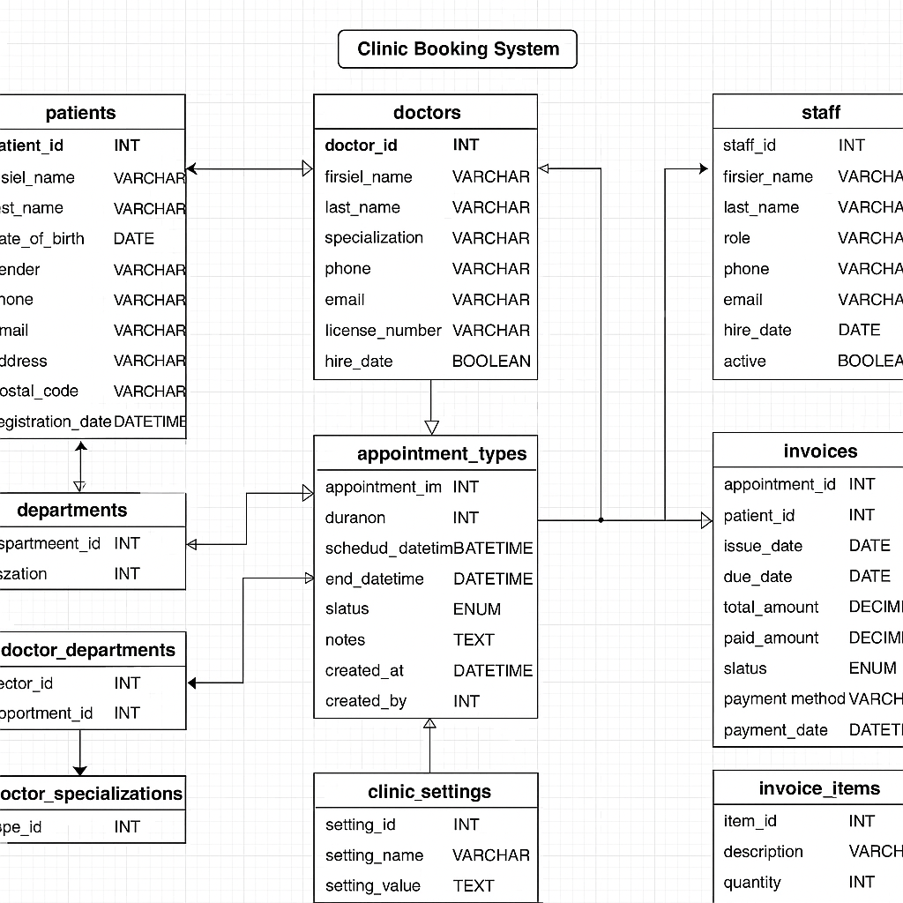

# Clinic Booking System Database

## ERD


## Description
A complete MySQL database implementation for a clinic booking system. This system manages:
- Patient information and medical records
- Doctor specialties and schedules
- Appointment booking and tracking
- Billing and invoicing
- Clinic departments and staff

## Features
- Patient registration and profile management
- Doctor scheduling and availability
- Appointment booking with different types
- Medical record keeping
- Billing and invoice generation
- Department management

## Setup Instructions
1. Install MySQL if not already installed
2. Clone this repository
3. Import the database:
   ```bash
   mysql -u username -p < clinic_booking_system.sql
4. Enter your MySQL password when prompted

## Usage
The database is ready to be used with any application that connects to MySQL. Several views are provided for common queries:

`todays_appointments` - Shows all appointments scheduled for today

`available_slots` - Shows currently available appointment slots

